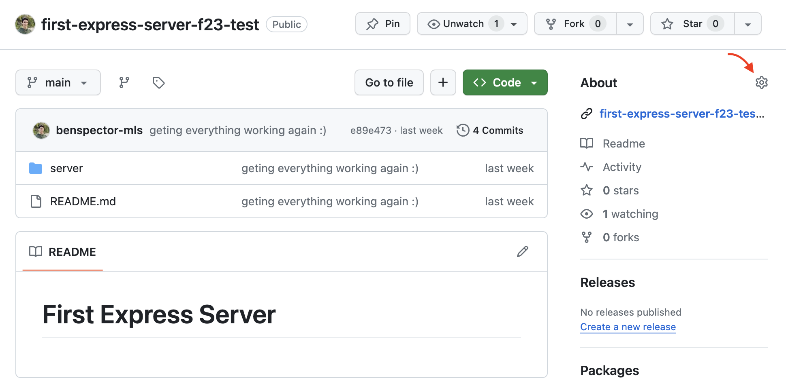

# My First Express Server

In this assignment, you will be tasked with creating and deploying a simple Express server. The server will have four GET endpoints, two that serve HTML and two that serve raw data. One of those data endpoints will use query parameters.

**Table of Contents**
- [Short Responses](#short-responses)
- [Starter Code](#starter-code)
- [Grading](#grading)
- [Part 1 - Setup](#part-1---setup)
- [Part 2 - Writing the Server Application](#part-2---writing-the-server-application)
- [Part 3 - Deploy](#part-3---deploy)
- [Submit](#submit)

## Short Responses

Do them first!!

## Starter Code

You will be given a blank repo for this one! You are building a server from scratch and will go through all the steps to set up a new Express project.

## Grading

Your grade on this assignment will be determined by the number of tasks you are able to complete. Tasks appear as a checkbox, like this:

- [ ] example of an incomplete task
- [x] example of an completed task

Feel free to mark these tasks as complete/incomplete, however your instructor will likely modify your tasks when grading.

This assignment has 13 tasks:
- 3 setup tasks
- 9 server application tasks
- 1 deployment task

You got this!

**Setup Technical Requirements**

- [ ] Has a `server` folder with an `index.js` file and a `package.json` file inside
- [ ] `package.json` has `express` installed as a dependency and `nodemon` as a dev dependency
- [ ] `package.json` has a `"dev"` script that uses `nodemon` and a `"start"` script that uses `node`

**Server Application Technical Requirements**

- [ ] In `index.js`, the `express()` function is used to create an `app`
- [ ] There are 4 controller functions
  - [ ] Two controllers send an HTML response (either raw HTML or an HTML file)
  - [ ] Two controllers send a data response
  - [ ] One of the controllers uses query parameters in some way (`req.query.parameterName`)
- [ ] There are 4 GET endpoints
  - [ ] Endpoints that provided data start with `/api` (ex: `/api/name` returns a name)
  - [ ] Endpoints that provide HTML start with `/` (ex: `/about` returns the about HTML page)
- [ ] The `app` listens on an available port (I recommend `8080`)

**Deployment Technical Requirements**

- [ ] Your GitHub page has a link to the deployed server in the About section. 

## Part 1 - Setup

**Create your files:**
* Create a `server` folder and `cd` into it.
* Run `npm init -Y` to create a `package.json` file.
* Create an `index.js` file in the `server` folder.

**Configure package.json**
* Run `npm i express` to install express
* Run `npm i -D nodemon` to install Nodemon as a dev dependency
* Modify the `package.json` file with the following `"scripts"`:

```json
"scripts": {
  "dev": "nodemon index.js",
  "start": "node index.js"
},
```

While working on your server, use `npm run dev` to run the server and have it restart whenever you make changes.

When deploying, you will use the `npm start` command to start the server using the normal `node` command.


## Part 2 - Writing the Server Application

Now it is time to write the server application! Refer to the [lecture notes](https://github.com/The-Marcy-Lab-School/8-0-0-intro-to-express) to build your Express server application.

The server should have four GET endpoints, two that serve HTML and two that serve raw data. One of those data endpoints will use query parameters. It is entirely up to *you* to decide the names of the endpoints your server makes available. However, the endpoints should follow the requirements below.

As you build your server, visit http://localhost:8080 (or whatever port number you chose) and test out your server!

## Part 3 - Deploy

When you're done, push your code to github and [follow these steps to deploy using Render](https://github.com/The-Marcy-Lab-School/render-deployment-instructions). Then, add the deployed link to your GitHub About section. Click on the gear icon to set the Website url (see below)



Here is an example of a deployed server: https://github.com/benspector-mls/first-express-server-f23-test

## Submit

Submit a link to your GitHub repository on Canvas.
